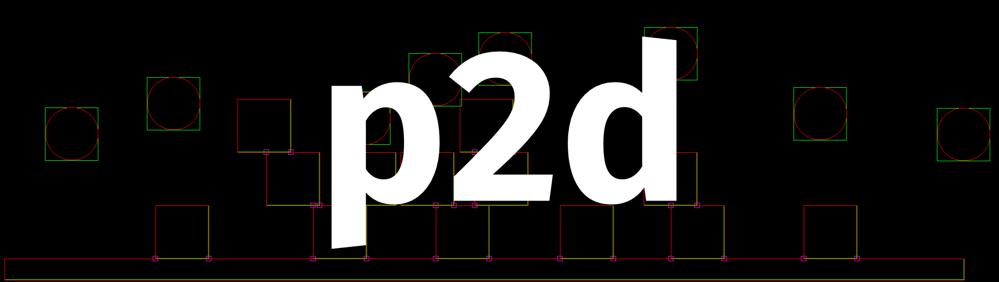

<div align="center">
    <picture style="width: 100%; height: auto;">
        <source srcset=".github/media/p2dlogo.png"  media="(prefers-color-scheme: dark)">
        
    </picture>
</div>

[](https://opensource.org/licenses/MIT)


---

A 2D rigidbody physics system written for yoyoengine.

## Features

- Broad phase collision detection, using a hashed spatial grid
- OOB and Circle collision detection and resolution
- Collision and trigger callbacks
- Easy synchronization with existing ECS

## Usage

```c
#include <p2d/p2d.h>

// example collision callback
void collision_callback(struct p2d_cb_data* data) {
  // ...
}

// example trigger callback
void trigger_callback(struct p2d_cb_data* data) {
  // ...
}

// at some point during init
p2d_init(TILE_SIZE, collision_callback, trigger_callback);

// create and register objects
// ...
struct p2d_object obj = {0};
obj.type = P2D_OBJECT_RECTANGLE,
obj.x = 100;
obj.y = 200;
obj.vx = 100;
obj.out_x = &YOUR_ECS_X;
obj.out_y = &YOUR_ECS_Y;
obj.out_rotation = &YOUR_ECS_ROTATION;
p2d_register_object(&obj);
// ...

// in your engine update loop: (run this at the hz you want your physics to run at)
p2d_step(physics_delta_time);

// before quitting, shutdown
p2d_shutdown();
```

## Future work

| Item                | Description                                 | Priority | Progress        |
|---------------------|---------------------------------------------|----------|-----------------|
| Debug Resolution    | The current basic resolution has edge cases | High     | In Progress     |
| Rotation Resolution | Implement rotation and torque               | High     | Planned         |
| Advanced Gravity    | Allow seperate spatial fields of gravity    | Medium   | Maybe Later     |
| New Shapes          | Implement planes for more complex shapes    | Low      | Maybe Later     |
| Optimization        | Micro-optimize for performance              | Low      | Maybe Later     |

## Testing

`cmake -DBUILD_P2D_TESTS=ON ..`

## Resources

Here are some resources that helped me along the way, which can hopefully be useful to you too!

- [(Book) Game Physics Engine Development](https://www.amazon.com/Game-Physics-Engine-Development-Commercial-Grade/dp/0123819768)
- [(Book) Real Time Collision Detection (Book)](https://a.co/d/g9Rpjsk)
- [(Youtube) Two-Bit Coding Physics Engine Playlist](https://www.youtube.com/playlist?list=PLSlpr6o9vURwq3oxVZSimY8iC-cdd3kIs)
